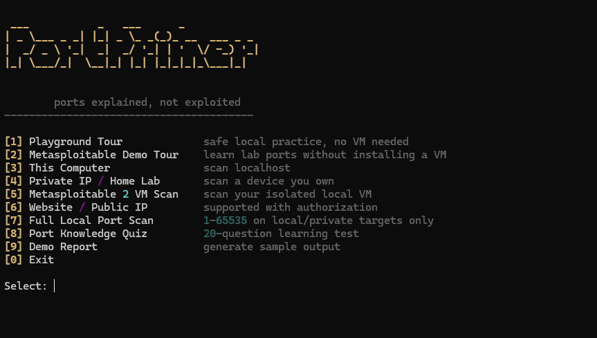
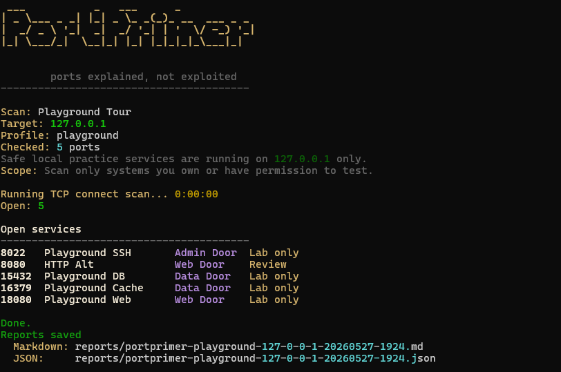
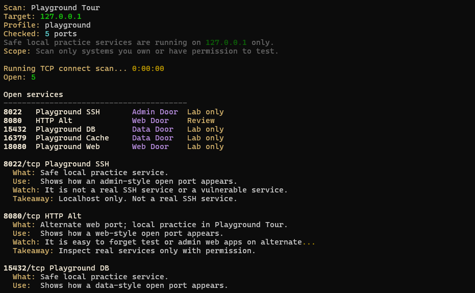
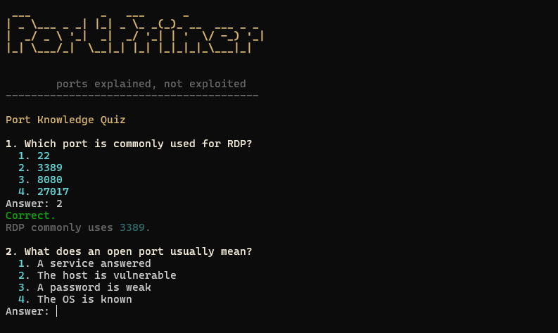
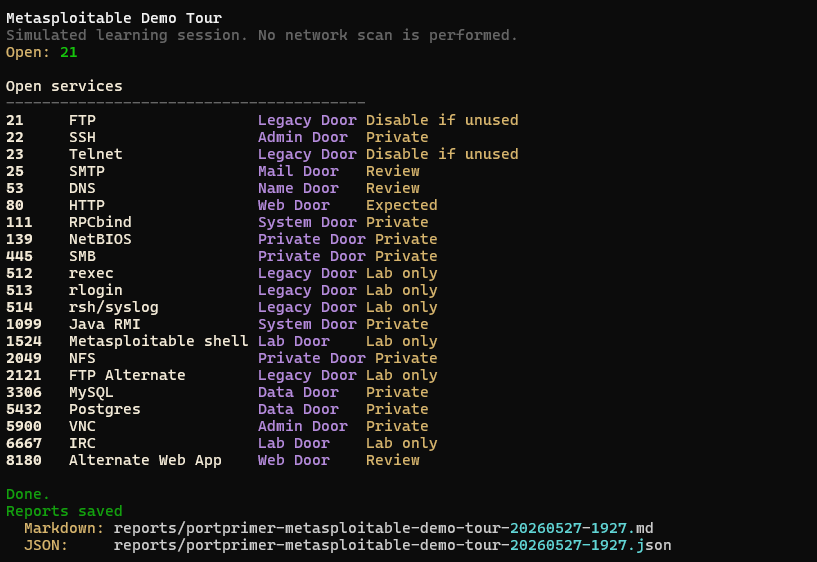
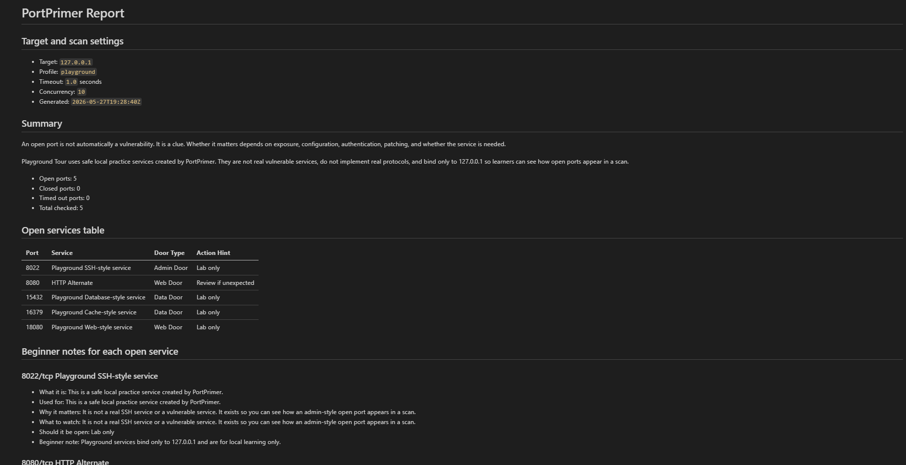

<div align="center">

# PortPrimer

**A port scanner that teaches you what the results actually mean.**

[](https://www.python.org/downloads/)
[](LICENSE)
[](tests/)
[](#)

<br />



</div>

<br />

## Why this exists

Most beginner port scanners give you the same answer: a port is open, a port is closed. That answer is technically correct and practically useless if you don't already know what port 6379 does, why anyone should care that 445 is reachable, or what a "Web Door" is versus an "Admin Door."

PortPrimer fills the gap between running a scan and understanding what just came back. Every open service shows up with context: what the service typically does, why exposure matters, and what to think about next. It's a learning tool first, a scanner second.

It is not a replacement for Nmap. It is not an exploit framework. It is not a vulnerability scanner. It is a way to learn what open services mean without needing someone over your shoulder to explain them.

<br />

## Features

- Safe TCP connect scanning with permission checks built in
- Six scan profiles covering web, admin, database, mail, and lab targets
- A localhost-only Playground Tour so you can practice without spinning up a VM
- A simulated Metasploitable Demo Tour for learning lab ports without installing the VM
- A 20-question Port Knowledge Quiz with category-based feedback
- A Port Learning Center covering ports, TCP vs UDP, and exposure concepts
- Full local port scanning (1-65535) limited to localhost, private IPs, and lab targets
- Markdown and JSON reports with beginner notes for every open service
- Authorized website and public IP scanning gated behind explicit confirmation
- Warm amber terminal UI built on Rich, not the usual blue

<br />

## Screenshots

### Playground Tour

Spin up safe local practice services on `127.0.0.1` and scan them in one command. No VM, no lab setup, no risk.



### Learning Notes

Every open service comes with a short, structured explanation. No fearmongering, no exploit walkthroughs, just context.



### Port Knowledge Quiz

Twenty randomized questions covering web ports, admin ports, databases, mail, lab safety, and exposure thinking. Each wrong answer comes with an explanation, and the final score tells you which categories to review.



### Metasploitable Demo Tour

Learn what the common Metasploitable 2 services are and why they matter, without installing Metasploitable 2.



### Reports

Every scan writes a Markdown report and a JSON report. The Markdown version is built to be readable on its own.



<br />

## Installation

PortPrimer needs Python 3.11 or newer. Pick the section for your operating system.

### Windows

```powershell
git clone https://github.com/oxajamal-byte/portprimer.git
cd portprimer
py -m venv .venv
.\.venv\Scripts\activate
py -m pip install -e .
```

### macOS

```bash
git clone https://github.com/oxajamal-byte/portprimer.git
cd portprimer
python3 -m venv .venv
source .venv/bin/activate
python3 -m pip install -e .
```

### Linux

```bash
git clone https://github.com/oxajamal-byte/portprimer.git
cd portprimer
python3 -m venv .venv
source .venv/bin/activate
python3 -m pip install -e .
```

### Verify the install

```bash
python -m pytest -q
```

You should see 62 tests pass. If something fails, open an issue with the output.

<br />

## Quick start

Launch the interactive menu:

```bash
python -m portprimer
```

On Windows:

```powershell
py -m portprimer
```

Or jump straight into the Playground Tour:

```bash
python -m portprimer playground
```

That single command starts five practice services on `127.0.0.1`, scans them, writes a Markdown and JSON report, and shuts everything down. It is the fastest way to see what PortPrimer does.

<br />

## Interactive modes

The interactive menu is the main way to use PortPrimer. It behaves like a workspace, not a one-shot script. After every action, you get a Next menu with four options: learn more, return to the main menu, run again, or quit.

```
[1] Playground Tour             safe local practice, no VM needed
[2] Metasploitable Demo Tour    learn lab ports without installing a VM
[3] This Computer               scan localhost
[4] Private IP / Home Lab       scan a device you own
[5] Metasploitable 2 VM Scan    scan your isolated local VM
[6] Website / Public IP         supported with authorization
[7] Full Local Port Scan        1-65535 on local/private targets only
[8] Port Knowledge Quiz         20-question learning test
[9] Demo Report                 generate sample output
[0] Exit
```

Each mode has a specific purpose:

| Mode | What it does | Requires |
| --- | --- | --- |
| Playground Tour | Spins up local practice services and scans them | Nothing |
| Metasploitable Demo Tour | Teaches Metasploitable-style ports with simulated results | Nothing |
| This Computer | Scans localhost with the beginner profile | Permission confirmation |
| Private IP / Home Lab | Scans a device on your local network | Permission confirmation |
| Metasploitable 2 VM | Scans your own isolated Metasploitable VM | Isolated lab, permission |
| Website / Public IP | Scans a public target you own or have written permission to test | Typing `AUTHORIZED` |
| Full Local Port Scan | Checks TCP 1-65535 on local or private targets only | Permission confirmation |
| Port Knowledge Quiz | Runs the 20-question quiz | Nothing |
| Demo Report | Generates a sample report without scanning | Nothing |

<br />

## Command line examples

Direct beginner scan against localhost:

```bash
python -m portprimer scan --target 127.0.0.1 --profile beginner --i-have-permission
```

Show learning notes inline:

```bash
python -m portprimer scan --target 127.0.0.1 --profile beginner --i-have-permission --explain
```

Custom ports:

```bash
python -m portprimer scan --target 127.0.0.1 --ports 22,80,443,3306 --i-have-permission
```

Authorized public scan (only on a target you own):

```bash
python -m portprimer scan --target your-domain.com --profile web --i-have-permission --allow-public-target
```

Full local port scan:

```bash
python -m portprimer scan --target 127.0.0.1 --full-range --i-have-permission
```

Quiz and Learning Center:

```bash
python -m portprimer quiz
python -m portprimer learn
```

<br />

## Scan profiles

| Profile | Ports | Use case |
| --- | --- | --- |
| `beginner` | 17 common learning ports across web, admin, mail, files, and databases | First scan |
| `web` | 80, 443, 8000, 8080, 8443 | Web services |
| `remote` | 22, 23, 3389, 5900 | Remote access |
| `database` | 1433, 1521, 3306, 5432, 6379, 9200, 27017 | Database services |
| `playground` | 8022, 8080, 15432, 16379, 18080 | Playground Tour only |
| `metasploitable2` | 23 common lab ports | Local Metasploitable 2 VM |

Custom port lists accept up to 100 comma-separated ports, reject duplicates, and reject anything outside 1-65535.

<br />

## Reports

Every scan writes two files to `reports/`:

```
reports/portprimer-playground-127-0-0-1-20260527-1928.md
reports/portprimer-playground-127-0-0-1-20260527-1928.json
```

The Markdown report includes target settings, a summary, an open services table, and beginner notes for every open service. The JSON file holds the same information in a structured format for tooling.

Reports are written locally and never transmitted anywhere.

<br />

## Responsible use

PortPrimer is built for authorized learning. The guardrails are deliberate.

- Direct command line scans require the `--i-have-permission` flag.
- Scans of public targets require the additional `--allow-public-target` flag.
- The interactive Website / Public IP mode requires you to type `AUTHORIZED`.
- Full range scans (1-65535) are refused for public targets, even with `--allow-public-target`.
- Playground services bind only to `127.0.0.1` and shut down when the scan finishes.

This refuses:

```bash
python -m portprimer scan --target example.com --profile web --i-have-permission
```

This is the supported form for an authorized public scan:

```bash
python -m portprimer scan --target example.com --profile web --i-have-permission --allow-public-target
```

The reason for the difference is simple. Tools like Nmap assume the operator already knows scope, permission, and consequences. PortPrimer assumes the user is learning, so the default behavior is the safe one. The flags are not blocks; they are a moment to confirm you actually have permission.

An open port is not automatically a vulnerability. It is a clue. Whether it matters depends on exposure, configuration, authentication, patching, and whether the service is needed at all.

<br />

## What PortPrimer does not do

- No SYN, stealth, or fragmented scanning
- No packet spoofing or decoy scanning
- No IDS or firewall evasion
- No exploitation, brute forcing, or credential testing
- No aggressive banner grabbing
- No OS fingerprinting
- No CIDR or mass scanning
- No claims about whether a system is secure or insecure

These are intentional limits. The goal is education, not offense.

<br />

## Project structure

```
portprimer/
├── portprimer/          Python package
│   ├── cli.py           Command line entry point
│   ├── menu.py          Interactive menu and workflow
│   ├── scanner.py       Async TCP connect scanner
│   ├── safety.py        Permission and target checks
│   ├── profiles.py      Scan profiles and port parsing
│   ├── knowledge.py     Port database with learning notes
│   ├── playground.py    Local practice services
│   ├── quiz.py          Port Knowledge Quiz
│   ├── learning.py      Port Learning Center
│   ├── report.py        Markdown and JSON report generation
│   └── ui.py            Rich terminal interface
├── docs/                Beginner guide, responsible use, design decisions
├── examples/            Sample reports
├── tests/               pytest suite, 62 tests
├── assets/              README screenshots
└── reports/             Generated locally, gitignored
```

<br />

## Running the tests

```bash
python -m pytest -q
```

The suite covers safety checks, profile parsing, scanner output, report generation, the playground services, the quiz, the learning center, the interactive menu, and the CLI output formatting.

<br />

## Design decisions

A few of the more interesting choices are documented in [`docs/design-decisions.md`](docs/design-decisions.md). The short version:

- TCP connect scanning only, because it's easy to understand and doesn't need raw socket privileges.
- Playground services use high ports (8022, 8080, 15432, 16379, 18080) and bind to `127.0.0.1` so they can't be reached from anywhere else.
- Full range scans are private-only because teaching the concept doesn't require enabling broad public scanning.
- Reports always include the full learning notes; the terminal output stays compact unless you ask for `--explain`.
- The interactive menu is built around a Next menu so users can chain actions without restarting the tool.

<br />

## Documentation

- [Beginner Guide](docs/beginner-guide.md)
- [Responsible Use](docs/responsible-use.md)
- [Metasploitable 2 Lab Setup](docs/metasploitable2-lab.md)
- [Design Decisions](docs/design-decisions.md)
- [Example Report](docs/example-report.md)
- [Security Policy](SECURITY.md)

<br />

## License

MIT. See [LICENSE](LICENSE).

<br />

---

<div align="center">

**Ports explained, not exploited.**

</div>